# IEEE-CIS Fraud Detection

## კონკურსის მიმოხილვა

Kaggle-ის IEEE-CIS Fraud Detection კონკურსის მიზანია საბანკო ტრანზაქციებში თაღლითობის გამოვლენა. მონაცემები შეიცავს ტრანზაქციის და identity-ს ინფორმაციას, სულ 432 მახასიათებელი ორი ცხრილის (transaction + identity) გაერთიანების შემდეგ. შეფასება ხდება ROC-AUC-ის (Area Under the Curve) საფუძველზე.

Kaggle-ზე მიღებული ქულა: **0.902979** (public) / **0.849917** (private)

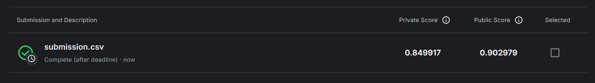

---

## პრობლემის გადაჭრის მიდგომა

ამ პრობლემის გადასაჭრელად გამოვიყენე სრული ML pipeline: მონაცემთა გაწმენდა → feature engineering → feature selection → მრავალი მოდელის ტრენინგი → საუკეთესო მოდელის შერჩევა და რეგისტრაცია.

თითოეული მოდელისთვის ცალკე notebook შევქმენი, სადაც სამი "კლასტერის" ჰიპერპარამეტრები გამოვცადე: **underfit** (ძალიან მარტივი კონფიგურაცია), **balanced** (ბალანსირებული) და **overfit** (ძალიან კომპლექსური). ყველა ექსპერიმენტი MLflow-ში ილოგება DagsHub-ზე. საბოლოოდ ყველა მოდელი `sklearn.Pipeline`-ის სახით შეინახა — preprocessing-ი და კლასიფიკატორი ერთ ობიექტად, რომ test set-ზე პირდაპირ გამოიძახო `predict_proba` წინასწარი დამუშავების გარეშე.

---

## რეპოზიტორიის სტრუქტურა

```
ml-assignment-fraud-detection/
│
├── Models/
│   ├── model_experiment_XGBoost.ipynb          ← EDA, preprocessing, feature selection, ტრენინგი, MLflow ლოგირება
│   ├── model_experiment_LogisticRegression.ipynb
│   ├── model_experiment_GradientBoosting.ipynb
│   ├── model_experiment_RandomForest.ipynb
│   ├── model_experiment_DecisionTree.ipynb
│   ├── model_experiment_AdaBoost.ipynb
│   ├── model_inference.ipynb                   ← MLflow-იდან საუკეთესო მოდელის ჩამოტვირთვა, პროგნოზი, submission.csv 
│   └── preprocessing.py                        ← FraudPreprocessor და ColumnSelector კლასები
│
├── Plots/
│   ├── class_distribution.png
│   ├── missing_values.png
│   ├── feature_engineering.png
│   ├── iv_scores.png
│   ├── rfe_rankings.png
│   ├── xgboost_iv_scores.png
│   ├── xgboost_training.png
│   ├── xgboost_roc.png
│   ├── lr_iv_scores.png
│   ├── lr_rfe_rankings.png
│   ├── lr_training.png
│   └── lr_roc.png
│
├── Data/                                        ← (git-ში არ არის რადგან ზედმეტად დიდი მოცულობისაა)
│   ├── train_transaction.csv
│   ├── train_identity.csv
│   ├── test_transaction.csv
│   └── test_identity.csv
│
├── mlflow_setup.py
├── submission.csv
├── score.png
└── README.md
```

---

## ფაილების აღწერა

| ფაილი | აღწერა |
|---|---|
| `model_experiment_XGBoost.ipynb` | მთავარი notebook, EDA-დან დაწყებული, გაწმენდა, feature engineering, feature selection, XGBoost-ის ტრენინგი სხვადასხვა ჰიპერპარამეტრებით. ყველა ექსპერიმენტი ილოგება MLflow-ში DagsHub-ზე. |
| `model_experiment_LogisticRegression.ipynb` | იგივე pipeline, Logistic Regression მოდელებით. |
| `model_experiment_GradientBoosting.ipynb` | იგივე pipeline, Gradient Boosting მოდელებით. |
| `model_experiment_RandomForest.ipynb` | იგივე pipeline, Random Forest მოდელებით. |
| `model_experiment_DecisionTree.ipynb` | იგივე pipeline, Decision Tree მოდელებით. |
| `model_experiment_AdaBoost.ipynb` | იგივე pipeline, AdaBoost მოდელებით. |
| `model_inference.ipynb` | საუკეთესო მოდელის ჩამოტვირთვა MLflow Model Registry-დან და submission-ის გენერაცია. |
| `preprocessing.py` | `FraudPreprocessor` და `ColumnSelector`, Pipeline-ში ჩასმული custom transformer-ები. |
| `submission.csv` | Kaggle-ზე ატვირთული პროგნოზები. |

---

## მონაცემთა გაწმენდა (Cleaning)

train_transaction და train_identity ცხრილების გაერთიანების შემდეგ მივიღეთ **432 feature**. ამ სვეტიდან ბევრი შეიცავს ძალიან ბევრ გამოტოვებულ მნიშვნელობას. პრობლემის გადასაჭრელად ვცადე ორი მიდგომა:

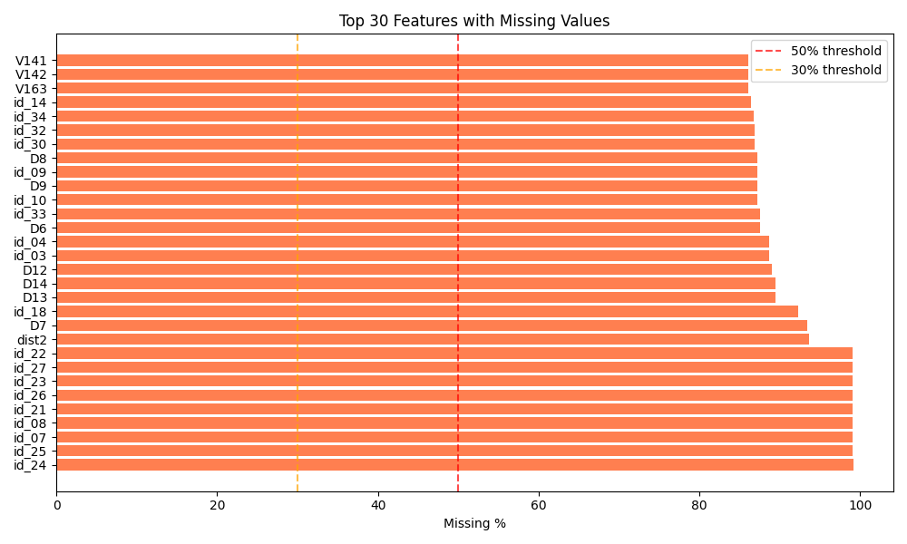

### მიდგომა 1, >50% missing threshold
ამოვიღე სვეტები, სადაც გამოტოვებული მნიშვნელობათა რაოდენობა 50%-ზე მეტი იყო. ეს გვაძლევდა **214 სვეტის** ამოღების საშუალებას. დარჩენილი ცარიელი უჯრები შევავსე: რიცხვითი სვეტები, **მედიანით** (მდგრადია გამონაკლისების მიმართ), კატეგორიული სვეტები, **მოდით** (ინარჩუნებს ყველაზე გავრცელებულ მნიშვნელობას).

**შედეგი: 218 feature**

### მიდგომა 2, >30% missing threshold
ამოვიღე სვეტები, სადაც გამოტოვება 30%-ზე მეტი იყო, ამან კიდევ უფრო შეამცირა სვეტების რაოდენობა (232 სვეტი).

**შედეგი: 200 feature**

**პირველი მიდგომა შევარჩიე**, რადგან XGBoost-ს შეუძლია missing values-ის (native missing value handling), ამიტომ ნაკლებ სვეტების ჩამოყრა უფრო მეტ სიგნალს ინარჩუნებს.

---

## Feature Engineering

ტრანზაქციის მონაცემებიდან შევქმენი ახალი მახასიათებლები, რომლებიც, ჩემი ვარაუდით, პირდაპირ კავშირშია fraud-თან:

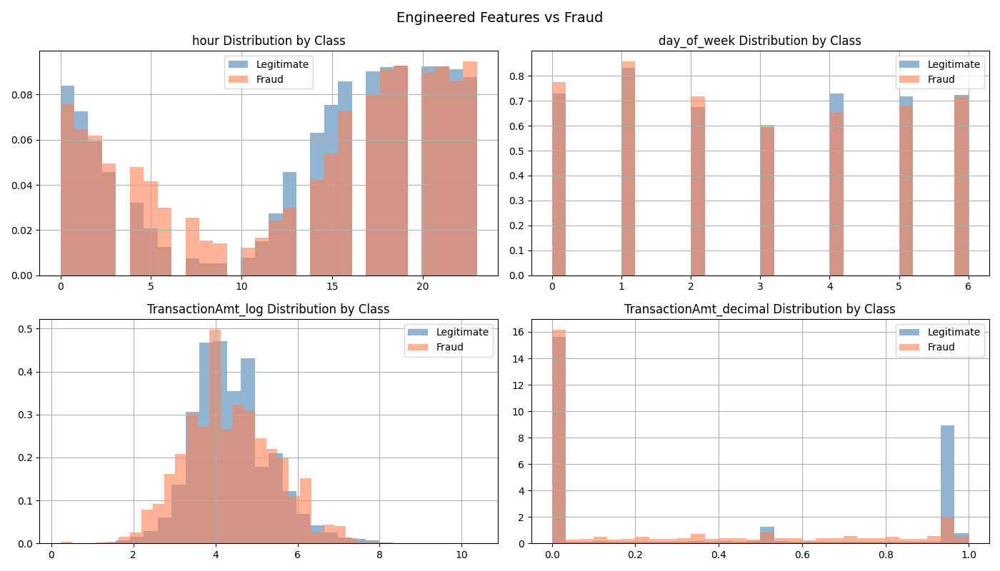

| ახალი feature | ფორმულა / იდეა |
|---|---|
| `hour` | `TransactionDT % 86400 // 3600`, დღის რომელ საათში მოხდა ტრანზაქცია |
| `day_of_week` | `TransactionDT // 86400 % 7`, კვირის რომელი დღე |
| `TransactionAmt_log` | `log1p(TransactionAmt)`, თანხის ლოგარითმი (ამცირებს skewness-ს) |
| `TransactionAmt_decimal` | `TransactionAmt - int(TransactionAmt)`, ათობითი ნაწილი (თაღლითური ტრანზაქციები ხშირად .00-ზე სრულდება) |

`TransactionDT` (raw unix offset) და `TransactionAmt` (raw amount) pipeline-ის მიერ ავტომატურად ამოიღება ახალი feature-ების შექმნის შემდეგ, რადგან მათი ინფორმაცია უკვე ახლებშია ასახული.

---

## კლასების განაწილება

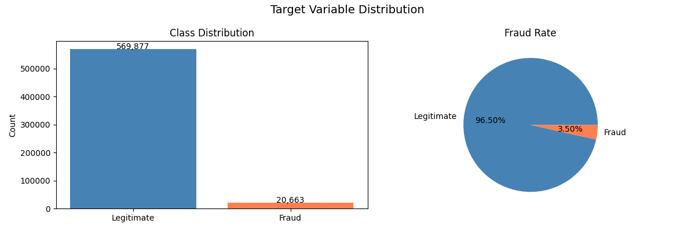

მონაცემები ძლიერ **imbalanced** (დისბალანსებულია): თაღლითობის შემთხვევები საერთო ტრანზაქციების მხოლოდ ~3.5%-ს შეადგენს. სწორედ ამიტომ შეფასების მეტრიკად ROC-AUC გამოიყენება, რადგან Accuracy-ი შეიძლება საკმარისად სწორი არ იყოს განსასაზღვრად. მოდელს შეუძლია 96.5% accuracy მიაღწიოს, თუ ყველაფერს "არა თაღლითობად" განიხილავს, მაგრამ ეს სრულიად უსარგებლო იქნება.

---

## კატეგორიული ცვლადების რიცხვებად გადაქცევა

fraud detection მონაცემებში კატეგორიული სვეტები წარმოდგენილია `object` dtype-ით — მაგ. `ProductCD`, `card4`, `card6`, `P_emaildomain`, `R_emaildomain`, `M1`-`M9` და სხვ. მოდელი ციფრულ მონაცემებს მოითხოვს, ამიტომ `FraudPreprocessor`-ი ყველა ასეთ სვეტს **One-Hot Encoding**-ით გარდაქმნის:

```python
pd.get_dummies(X, columns=cat_cols, drop_first=True)
```

**One-Hot Encoding** ავირჩიე, რადგან:
- კატეგორიებს შორის ბუნებრივი თანმიმდევრობა არ არსებობს (მაგ. `visa` არ არის "უფრო დიდი" ვიდრე `mastercard`)
- `drop_first=True` ამცირებს multicollinearity-ს — პირველი კატეგორია ბაზელინად რჩება, დანარჩენები 0/1 სვეტებად

train-ის fit-ის დროს Pipeline ინახავს dummy სვეტების სახელებს (`dummies_cols_`) და test set-ზეც იგივე სვეტების სტრუქტურას ქმნის — ამიტომ train/test-ს შორის column mismatch-ი არ ხდება.

---

## Feature Selection

### ეტაპი 1, Information Value (IV > 0.02)

**IV (Information Value)** გვიჩვენებს, რამდენად კარგად ახდენს კონკრეტული feature target ცვლადის (isFraud) განმასხვავებლობას. თუ feature-ს IV < 0.02, ის პრაქტიკულად უსარგებლოა პროგნოზირებისთვის.

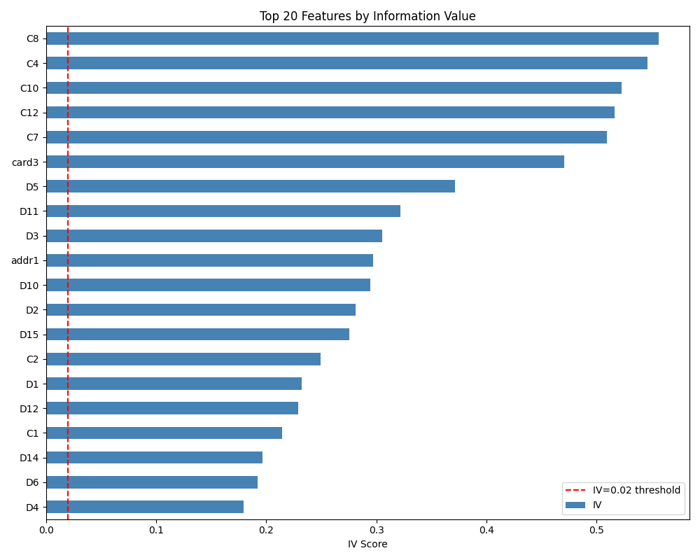


IV threshold-ად 0.02 ავირჩიე, რადგან:
- ძალიან დაბალი threshold (0.001) ბევრ ხმაურიან სვეტს ტოვებს
- ძალიან მაღალი threshold (0.1) შეიძლება ზედმეტად ბევრ სასარგებლო სვეტი გააქროს

**შედეგი: 34 feature (XGBoost) / 30 feature (Logistic Regression)**

### ეტაპი 2, RFE (Recursive Feature Elimination)

გადამოწმების მიზნით ასევე გამოვიყენე **RFE LogisticRegression-ით (top-30)**, ეს მეთოდი იტერაციულად ამოიღებს ყველაზე სუსტ feature-ებს.

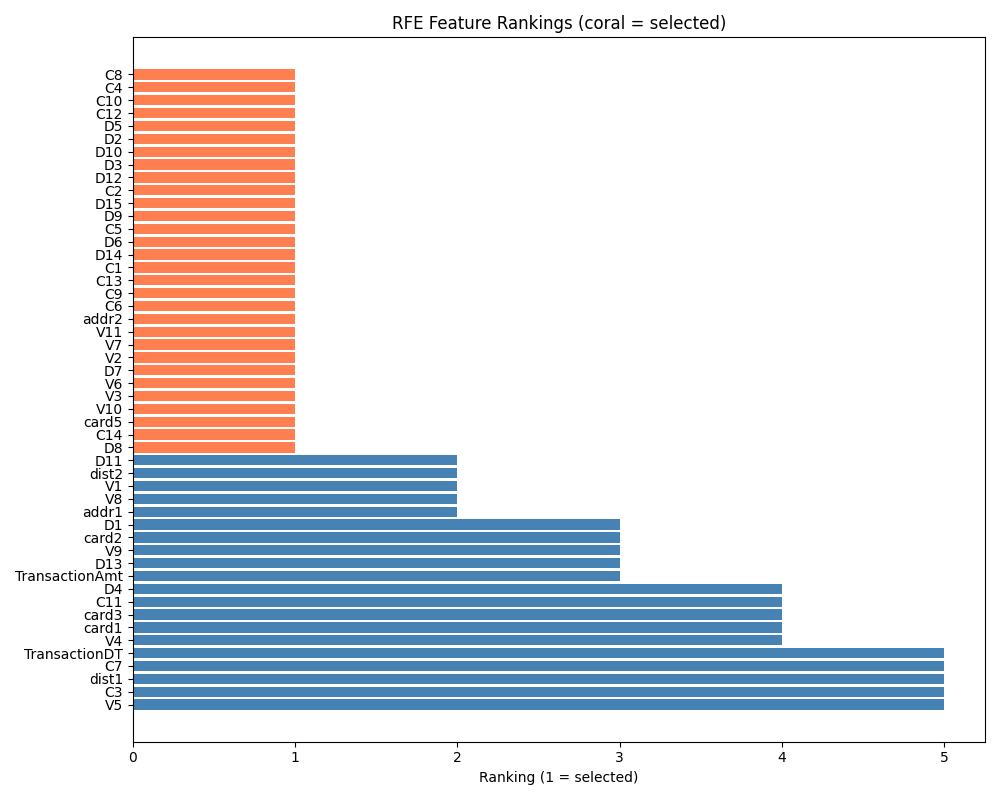
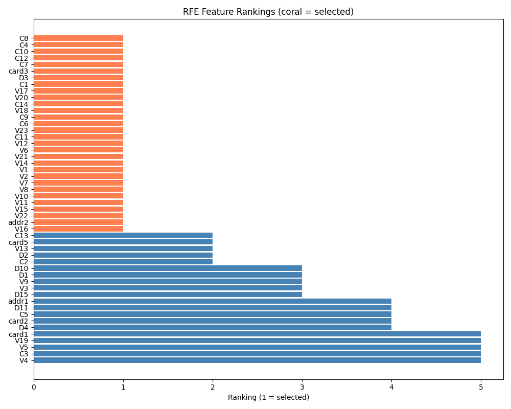

ორივე მეთოდი ძირითადად ერთსა და იმავე სვეტებს ირჩევს. **IV შეირჩა** საბოლოოდ, რადგან XGBoost-ისთვის 34-ფეიჩერიანი ნაკრები უფრო ფართო სიგნალს ინარჩუნებს ხის გაყოფებისთვის.

---

## ტრენინგი და ჰიპერპარამეტრების ოპტიმიზაცია

თითოეული მოდელი ვცადე სამ "კლასტერად": **underfit** (ძალიან მარტივი), **balanced** (ბალანსირებული) და **overfit** (ძალიან კომპლექსური), თითო კლასტერში 6-6-12 run, სულ **30 run** თითო მოდელზე.

---

### 1. Logistic Regression

ყველაზე მარტივი baseline მოდელი, წრფივი გამყოფი სიბრტყის პოვნა fraud-ის და არა-fraud-ის ტრანზაქციებს შორის.

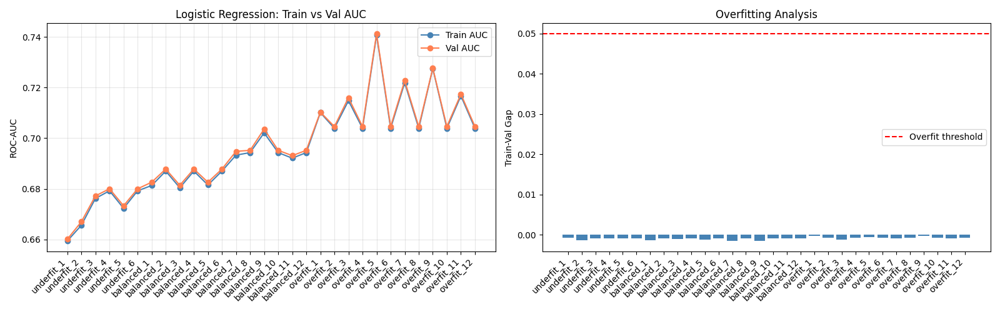
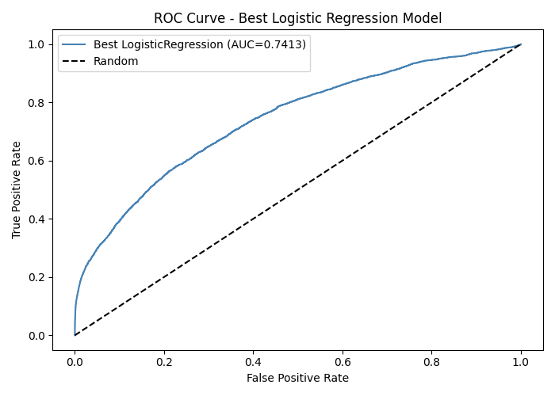
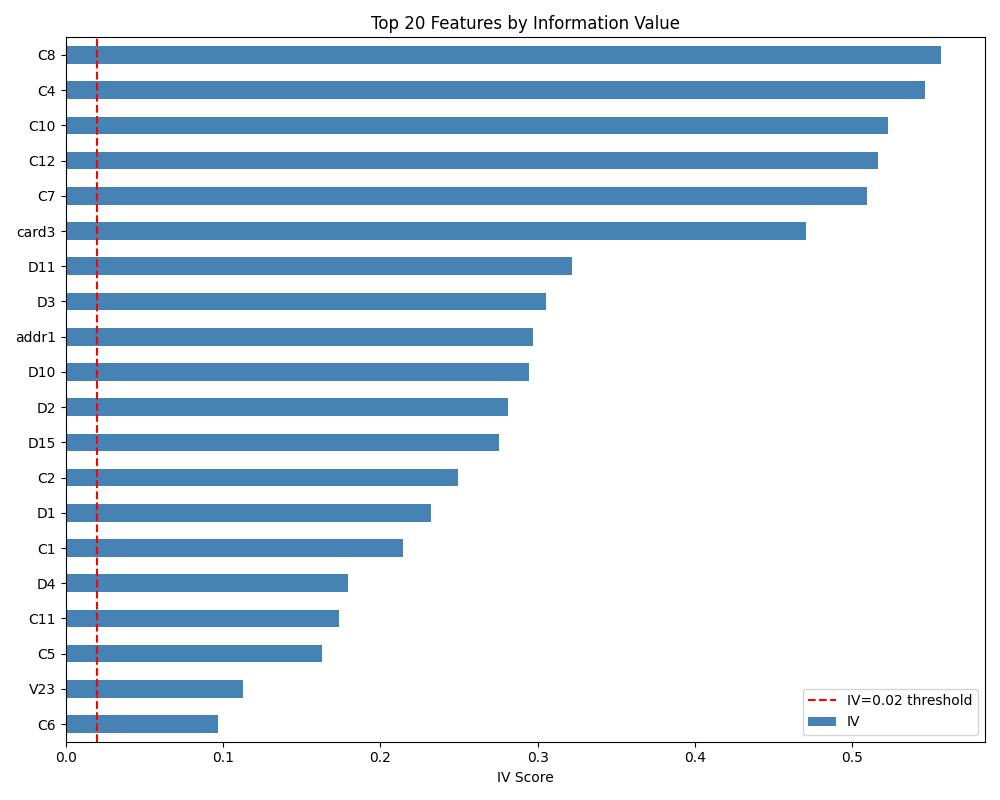

| label | C | max_iter | solver | train_auc | val_auc | gap | შეფასება |
|---|---|---|---|---|---|---|---|
| underfit_6 | 0.05 | 200 | saga | 0.6792 | 0.6800 | -0.0009 | underfit |
| balanced_12 | 10.0 | 1000 | saga | 0.6943 | 0.6952 | -0.0008 | underfit |
| **overfit_5** ✅ | **200.0** | **1000** | **lbfgs** | **0.7407** | **0.7413** | **-0.0006** | **good** |

**დასკვნა:** Logistic Regression ამ ამოცანისთვის ძალიან სუსტია, val_auc=0.74 აჩვენებს, რომ ტრანზაქციის მონაცემები წრფიურად გამოუყოფელია. C პარამეტრის ზრდამ გარკვეულად გააუმჯობესა შედეგი, მაგრამ ფუნდამენტური შეზღუდვა არ შეიცვალა. gap-ი უარყოფითიც კი გახდა, რაც underfitting-ზე მიუთითებს, მოდელი ტრენინგ მონაცემებსაც ვერ წყვეტს.

---

### 2. Decision Tree

Decision Tree-ი საშუალებას გვაძლევს გამოვავლინოთ არაწრფივი ურთიერთობები, მაგრამ max_depth-ს დიდი გავლენა აქვს შედეგებზე.

| label | max_depth | min_samples_split | min_samples_leaf | train_auc | val_auc | gap | შეფასება |
|---|---|---|---|---|---|---|---|
| underfit_6 | 5 | 200 | 100 | 0.7795 | 0.7747 | 0.0048 | underfit |
| **balanced_12** ✅ | **15** | **100** | **50** | **0.9007** | **0.8690** | **0.0317** | **good** |
| overfit_1 | 20 | 5 | 2 | 0.9432 | 0.8192 | 0.1240 | overfit |
| overfit_5 | None | 2 | 1 | 0.9969 | 0.7983 | 0.1986 | overfit |

**დასკვნა:** სიღრმე კრიტიკულია. `max_depth=None` (შეუზღუდავი) მოდელი თითქმის იდეალურად ისწავლის ტრენინგ მონაცემებს (train=0.9969), მაგრამ ვალიდაციაზე ცუდია (val=0.7983, gap=0.1986), ის noise-ისკენ მიდრეკილია. `max_depth=15` ბალანსს ინარჩუნებს. Decision Tree-ის შედეგი val=0.8690 კარგია baseline-სთვის, მაგრამ ensemble მეთოდები მას მნიშვნელოვნად ჯობნიან.

---

### 3. AdaBoost

AdaBoost სერიულად ამატებს სუსტ კლასიფიკატორებს - თითოეული ფოკუსირდება წინა შეცდომებზე.

| label | n_estimators | learning_rate | train_auc | val_auc | gap | შეფასება |
|---|---|---|---|---|---|---|
| underfit_6 | 50 | 0.01 | 0.7715 | 0.7735 | -0.0021 | underfit |
| balanced_12 | 350 | 0.10 | 0.8337 | 0.8337 | -0.0001 | underfit |
| overfit_6 | 600 | 1.00 | 0.8624 | 0.8602 | 0.0022 | good |
| **overfit_12** ✅ | **1000** | **1.00** | **0.8649** | **0.8626** | **0.0023** | **good** |

**დასკვნა:** AdaBoost-ს gap-ი ძალიან მცირეა (0.0023), ანუ overfitting-ი პრაქტიკულად არ ხდება. ეს AdaBoost-ის ბუნებრივი თვისებაა, ის თავისთავად regularization-ს ახდენს boosting პროცესის გზით. მიუხედავად ამისა, val=0.8626 შედარებით სუსტია სხვა ensemble მეთოდებთან.

---

### 4. Gradient Boosting

Gradient Boosting უფრო ძლიერი boosting ალგორითმია, gradient descent-ით ოპტიმიზდება.

| label | n_estimators | max_depth | learning_rate | train_auc | val_auc | gap | შეფასება |
|---|---|---|---|---|---|---|---|
| underfit_6 | 50 | 2 | 0.050 | 0.8269 | 0.8239 | 0.0030 | underfit |
| balanced_12 | 350 | 4 | 0.100 | 0.9069 | 0.8988 | 0.0081 | good |
| **overfit_3** ✅ | **400** | **8** | **0.200** | **0.9928** | **0.9457** | **0.0471** | **good** |

**დასკვნა:** Gradient Boosting-მა ძლიერი შედეგი აჩვენა (val=0.9457). `max_depth=8` და `lr=0.2` ოპტიმალური კომბინაცია აღმოჩნდა. gap=0.0471 ახლოსაა 0.05 ზღვართან, მაგრამ მაინც "good" კლასიფიკაციაში ხვდება. ეს მოდელი XGBoost-ის ძალიან ახლო კონკურენტია.

---

### 5. Random Forest

Random Forest პარალელურად ბევრ decision tree-ს ატრენინგებს და შედეგებს საშუალო ვოტინგით აერთიანებს.

| label | n_estimators | max_depth | min_samples_split | min_samples_leaf | train_auc | val_auc | gap | შეფასება |
|---|---|---|---|---|---|---|---|---|
| underfit_6 | 30 | 4 | 200 | 100 | 0.8324 | 0.8285 | 0.0039 | underfit |
| balanced_12 | 350 | 15 | 50 | 20 | 0.9218 | 0.9038 | 0.0180 | good |
| **overfit_6** ✅ | **400** | **30** | **2** | **1** | **0.9933** | **0.9411** | **0.0522** | **overfit** |
| overfit_7 | 400 | 30 | 5 | 2 | 0.9878 | 0.9403 | 0.0475 | good |

**დასკვნა:** Random Forest-ი ძალიან კარგ val_auc-ს (0.9411) აჩვენებს, მაგრამ overfit_6-ის gap=0.0522 ოდნავ "overfit" ზღვარს (0.05) სცდება. overfit_7 ოდნავ უარეს val_auc-ს, მაგრამ gap=0.0475 ბალანსირებულ შედეგს გვაძლევს. მეხსიერების მიხედვით Random Forest ბევრ ხეს ინახავს, production-ში ეს memory-ს პრობლემაა. XGBoost ამ ამოცანაში უფრო ეფექტური აღმოჩნდა.

---

### 6. XGBoost

XGBoost, optimized gradient boosting framework, რომელიც regularization-ს, column subsampling-ს და missing values-ის native handling-ს აერთიანებს.

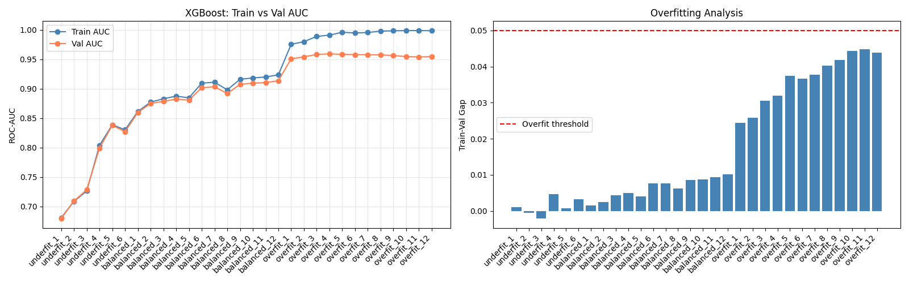
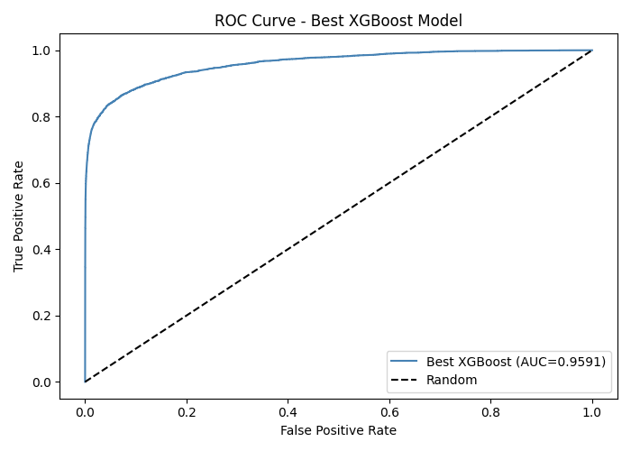

| label | n_estimators | max_depth | learning_rate | train_auc | val_auc | gap | შეფასება |
|---|---|---|---|---|---|---|---|
| underfit_6 | 50 | 3 | 0.010 | 0.8302 | 0.8270 | 0.0032 | underfit |
| balanced_12 | 350 | 5 | 0.050 | 0.9236 | 0.9135 | 0.0101 | good |
| overfit_3 | 400 | 8 | 0.100 | 0.9888 | 0.9583 | 0.0305 | good |
| **overfit_4** ✅ | **500** | **10** | **0.100** | **0.9910** | **0.9591** | **0.0319** | **good** |
| overfit_5 | 600 | 10 | 0.100 | 0.9959 | 0.9584 | 0.0375 | good |

**დასკვნა:** XGBoost-მა ყველა მოდელს შორის საუკეთესო val_auc=**0.9591** აჩვენა. `n_estimators=500`, `max_depth=10`, `learning_rate=0.1`, ოპტიმალური კომბინაცია. gap=0.0319 კარგ ბალანსს ნიშნავს, მოდელი საკმარისად complex-ია პატერნების სასწავლად, მაგრამ overfitting-ი კონტროლში რჩება. XGBoost-ი native missing value handling-ის წყალობით Approach 1-ის cleaning-ს ისეც ოპტიმალურად ამუშავებს.

---

## საუკეთესო მოდელის შერჩევა

ყველა ექსპერიმენტი შედარდა `val_auc`-ის მიხედვით MLflow-ის მეშვეობით:

```python
best_run = mlflow.search_runs(
    experiment_names=["XGBoost_FraudDetection", "LogisticRegression_FraudDetection",
                      "GradientBoosting_FraudDetection", "RandomForest_FraudDetection",
                      "DecisionTree_FraudDetection", "AdaBoost_FraudDetection"],
    order_by=["metrics.val_auc DESC"]
).iloc[0]
```

`val_auc` ავირჩიე მთავარ შესადარებელ მეტრიკად, რადგან:
- ის პირდაპირ ზომავს, რამდენად კარგად ახდენს მოდელი fraud-ის გამოვლენას ახალ, უხილავ ტრანზაქციებზე
- imbalanced dataset-ზე AUC ბევრად სანდოა, ვიდრე accuracy
- Kaggle-ის ოფიციალური მეტრიკაც სწორედ AUC-ია

**train_auc-ს და val_auc-ს ერთად ვლოგავდი**, რომ overfitting-ი ვაკონტროლო: gap > 0.05 → overfit. gap < 0.05 → ბალანსირებული.

### ყველა მოდელის შედარება

| მოდელი | val_auc | train_auc | gap | სტატუსი |
|---|---|---|---|---|
| **XGBoost** ✅ | **0.9591** | **0.9910** | **0.0319** | **good** |
| Gradient Boosting | 0.9457 | 0.9928 | 0.0471 | good |
| Random Forest | 0.9411 | 0.9933 | 0.0522 | overfit |
| Decision Tree | 0.8690 | 0.9007 | 0.0317 | good |
| AdaBoost | 0.8626 | 0.8649 | 0.0023 | good |
| Logistic Regression | 0.7413 | 0.7407 | -0.0006 | underfit |

**გამარჯვებული: XGBoost** (n_estimators=500, max_depth=10, learning_rate=0.1)

| მეტრიკა | მნიშვნელობა |
|---|---|
| val_auc | 0.9591 |
| train_auc | 0.9910 |
| train_val_gap | 0.0319 |
| Kaggle Public Score | **0.902979** |
| Kaggle Private Score | **0.849917** |

---

## MLflow ექსპერიმენტები DagsHub-ზე

ყველა ექსპერიმენტი ასახულია: [dagshub.com/lchit22/ml-assignment-fraud-detection](https://dagshub.com/lchit22/ml-assignment-fraud-detection.mlflow)

თითოეულ run-ში დაილოგა:

**პარამეტრები** (model-ის მიხედვით იცვლება):
- XGBoost / GB: `n_estimators`, `max_depth`, `learning_rate`
- Random Forest: `n_estimators`, `max_depth`, `min_samples_split`, `min_samples_leaf`
- Decision Tree: `max_depth`, `min_samples_split`, `min_samples_leaf`
- AdaBoost: `n_estimators`, `learning_rate`
- Logistic Regression: `C`, `max_iter`, `solver`
- ყველა: `model`, `feature_selection_approach`, `n_features`

**მეტრიკები:**
- `train_auc`, `val_auc`, ტრენინგისა და ვალიდაციის AUC
- `train_val_gap`, overfitting-ის ინდიკატორი

`val_auc` ავირჩიე მთავარ შერჩევის მეტრიკად, რადგან ის პირდაპირ ასახავს მოდელის მუშაობას ახალ (validation) მონაცემებზე. `train_auc` ერთად დავლოგე, რათა overfitting-ი შევაფასო, თუ train-ზე AUC ძალიან მაღალია და val-ზე დაბალი, ეს overfitting-ია. ანუ ეს ორი მეტრიკის წყვილი მაძლევს სურათს არა მხოლოდ "რამდენად ზუსტია" მოდელი, არამედ "რამდენად სტაბილურად" მუშაობს ის უცნობ ტრანზაქციებზე.

`train_val_gap` ცალკე დავლოგე, რომ MLflow-ის UI-ში პირდაპირ დავახარისხო, ბალანსირებული მოდელების სწრაფი გამოვლენა.

### ექსპერიმენტების სტრუქტურა

| Experiment | Run Volume | Parameters Explored |
|---|---|---|
| XGBoost_FraudDetection | 30 runs | n_estimators, max_depth, learning_rate |
| LogisticRegression_FraudDetection | 30 runs | C, max_iter, solver |
| GradientBoosting_FraudDetection | 30 runs | n_estimators, max_depth, learning_rate |
| RandomForest_FraudDetection | 30 runs | n_estimators, max_depth, min_samples_split, min_samples_leaf |
| DecisionTree_FraudDetection | 30 runs | max_depth, min_samples_split, min_samples_leaf |
| AdaBoost_FraudDetection | 30 runs | n_estimators, learning_rate |
| **Total** | **180 runs** | tracked in MLflow |

---

## გამოცდილება და დასკვნები

ამ პროექტმა პრაქტიკულად დამანახა, რომ კარგი შედეგი მხოლოდ "სწორი" მოდელის არჩევაზე არ არის დამოკიდებული. 432 feature-იანი raw dataset-იდან მნიშვნელოვანი ნაბიჯები იყო სწორი cleaning, feature engineering და feature selection.

ამ პროექტის საშუალებით ვისწავლე, რომ:

- **imbalanced dataset-ზე** AUC ბევრად სანდო მეტრიკაა, ვიდრე accuracy, კლასების დისბალანსი accuracy-ს კარგად მიჩვენებს, მაგრამ მოდელი შეიძლება სრულიად უსარგებლო იყოს.
- **feature engineering** ხშირად უფრო ძლიერია, ვიდრე მოდელის სირთულის გაზრდა, `hour` და `TransactionAmt_decimal` პატარა feature-ები არსებითად გავლენიანია.
- **train/val gap** აუცილებელი მეტრიკაა, მაღალი val_auc-ი ისე, რომ gap კონტროლში არ არის, production-ში ცუდ სიურპრიზს გვაძლევს.
- **XGBoost** განსაკუთრებით ეფექტურია sparse და noisy feature-ებიანი ტრანზაქციის მონაცემებისთვის, native missing value handling, regularization და column subsampling მის ძლიერ მხარეებია.
- **MLflow-ის სწორი tracking** (parameter + metric logging ყოველ run-ში) ისეთივე მნიშვნელოვანია, როგორც თავად მოდელის ტრენინგი, 180 run-ის გარეშე "საუკეთესო" კომბინაციის ხელით პოვნა შეუძლებელი იქნებოდა.
